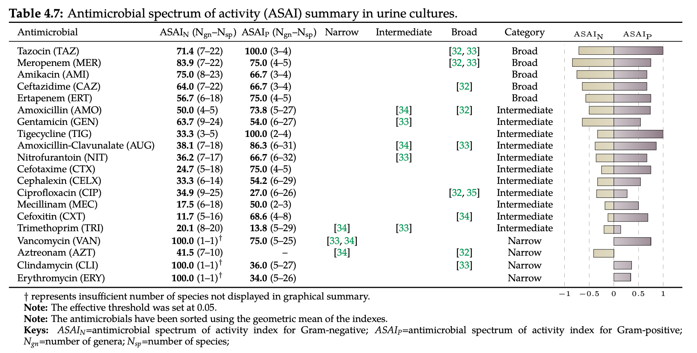

Welcome to pyAMR's documentation!
=================================

.. image:: ./_static/images/logo-pyamr-v1.png
   :width: 100
   :align: right
   :alt: pyAMR

``PyAMR`` is a python lightweight library to facilitate the computation of common
Antimicrobial Resistance (AMR) related statistics such as the proportion
of resistance isolates, the resistance trend or the antimicrobial spectrum
of activity. In addition, it includes a number of examples to visualise
such information which relay on plotting libraries such as ``matplotlib``,
``seaborn`` or ``plotly``.

.. raw:: html

   

      <a href="https://github.com/bahp/pyamr/" target="_blank">
         <button class="btn-github"> View on GitHub
            
         </button>
      </a>

      <a href="https://www.mdpi.com/2079-6382/10/10/1267" target="_blank">
         <button class="btn-github">Manuscript
            
         </button>
      </a>

      <a href="https://youtu.be/32pTOcXszyg" target="_blank">
         <button class="btn-github"> Video on Youtube
            
         </button>
      </a>

   

     

To briefly showcase some of the AMR metrics that can be computed using this library we
have included two Figures. The first Figure presents information related to antimicrobial
resistance metrics for those ``urine`` specimens in which ``Escherichia coli`` was grown and tested.
The table contains the following information which is also displayed in the graphs below:

 - ``R`` is the overall resistance; that is, proportion of resistance isolates.
 - ``TM`` is the monthly resistance trend.
 - ``TY`` is the yearly resistance trend.
 - ``pearson`` is the correlation coefficient to discern whether there is a linear correlation
   between the number of isolates (records) used to compute the resistance and the overall
   resistance obtained. They should not be correlated (-0.5 <= pearson <= 0.5).
 - ``isolates`` is the the number of isolates used to compute such metrics.
 - ``references`` includes manuscripts within the literate which presented similar resistance
   values to the ones displayed in the table. For more information about these, see the
   original manuscript (button above).

.. image:: ./_static/imgs/todo-sart-table.png

The second Figure presents information related to the computation of the antimicrobial spectrum of
activity for all the antimicrobials tested on ``urine`` samples. The table includes references to
the literature with the corresponding associated category (eg.g narrow, intermediate and broad). While
these three profiles appeared in the mid-1950s, little effort has been made to define them. Furthermore,
such ambiguous labels are overused for different and even contradictory purposes. In addition, the
table includes the following columns:

 - ``antimicrobial`` is the antimicrobial
 - ``ASAI_N`` is the spectrum of activity against gram negative bacteria.
 - ``ASAI_P`` is the spectrum of activity against gram positive bacteria.
 - ``N_gn`` is the number of different (unique) genus.
 - ``N_sp`` is the number of different (unique) species.

When using any of this project's source code, please cite:

.. code-block::

   @article{hernandez2021resistance,
     title = {Resistance Trend Estimation Using Regression Analysis to Enhance Antimicrobial Surveillance: A Multi-Centre Study in London 2009--2016},
     author = {Hernandez, Bernard and Herrero-Vi{\~n}as, Pau and Rawson, Timothy M and Moore, Luke SP and Holmes, Alison H and Georgiou, Pantelis},
     journal = {Antibiotics},
     volume = {10},
     number = {10},
     pages = {1267},
     year = {2021},
     month = oct,
     publisher = {MDPI},
     doi = {10.3390/antibiotics10101267},
     url = {},
   }

.. .. image:: ./_static/imgs/logo-icl-square.png
   :width: 50
   :align: right
   :alt: Imperial College London

.. note::

    The PhD thesis is available on Spiral: https://spiral.imperial.ac.uk/handle/10044/1/73000

.. .. bibliography::

.. :cite:p:`espaur2017`
.. :cite:p:`ecdc2016`
.. :cite:p:`world2017global`
.. :cite:t:`2018:hernandez`.
.. :cite:p:`2018:hernandez`.
.. :footcite:t:`2018:hernandez`
.. :footcite:t:`rawson2021real`
.. :cite:p:`o2014antimicrobial`

.. toctree::
   :maxdepth: 2
   :caption: Contents:

.. toctree::
   :maxdepth: 2
   :caption: Tutorial
   :hidden:

   usage/introduction
   usage/installation
   usage/quickstart
   usage/registries
   usage/todo

.. toctree::
   :maxdepth: 2
   :caption: Example Galleries
   :hidden:

   _examples/tutorial/index
   _examples/indexes/index
   _examples/forecasting/index
   _examples/reports/index
   _examples/visualization/index

.. toctree::
   :maxdepth: 2
   :caption: API
   :hidden:

   _apidoc/pyamr

Indices and tables
==================

* :ref:`genindex`
* :ref:`modindex`
* :ref:`search`

