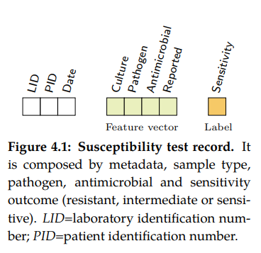

Introduction
============

The growing threat of antimicrobial resistance (AMR) is a leading patient health and
safety issue, with estimates that AMR will be responsible for more than 10 million deaths
by 2050. A major driver of AMR has been the misuse of antimicrobials in humans. Whilst reasons
for the misuse of antimicrobials are complex and multifaceted, a number of factors have been
described and investigated. At the individual level, physicians often prioritise the management
of the patient being treated, paying little regard to the long-term consequences of overusing
antimicrobials. Moreover, the majority of antimicrobials are prescribed by individuals who are
not experts in infection management and may have limited understanding of antimicrobials and the
potential consequences of AMR.

For such reason, numerous health organizations have promoted antimicrobial surveillance to regulate
prescriptions within clinical practice. At national level, Public Health England implemented the
English surveillance program for antimicrobial utilisation and resistance (ESPAUR) which
provides annual reports as a benchmark to determine appropriate local action [11–14].
At international level, the European Centre for Disease Prevention and Control through
the European antimicrobial resistance surveillance network (EARS-Net) has created the
largest publicly funded system for antimicrobial surveillance in Europe. Furthermore, the World Health
Organization has recently implemented the global antimicrobial resistance surveillance system (GLASS)
to strengthen the evidence base on AMR and inform decision-making.

With increasing electronic recording of data, there is a growing interest in the potential secondary
use of microbiology records to provide the necessary information to support antimicrobial stewardship
programs [20]. These programs are crucial to guide health care organizations designing evidence-based
policies to combat AMR [21, 22]. In particular, susceptibility reporting has shown to be a determinant
data source to inform empiric antimicrobial therapy selection

Susceptibility test records (see Figure 4.1) are composed by laboratory identification
number (LID), patient identification number (PID), date, sample type or culture (e.g.
blood or urine), pathogen, antimicrobial, reported status and outcome (resistant, sensitive
or intermediate). In research, the susceptibility test data is usually first grouped by
specimen or culture type, and further grouped by pairs (pathogen, antimicrobial)
since it is widely accepted by clinicians as detailed in the UK five year strategy in AMR [21].

The AMR indexes
---------------

======== ============================================== =============
Acronym  Full name                                      Status
======== ============================================== =============
``SARI`` Single Antimicrobial Resistance Index          ``Ok``
``MARI`` Multiple Antimicrobial Resistance Index        ``Pending``
``DRI``  Drug Resistance Index                          ``Pending``
``SART`` Single Antimicrobial Resistance Trend          ``Pending``
``ASAI`` Antimicrobial Spectrum of Activity Index       ``Ok``
======== ============================================== =============

- Single Antibiotic Resistance Index (SARI)

    This index describes the proportion of resistant isolates for a given set of susceptibility
    tests. It provides a value within the range [0,1] where values close to one indicate high
    resistance. It is agnostic to pathogen, antibiotic and time. The variables R, I and S represent
    the number of susceptibility tests with Resistant, Intermediate and Susceptible outcomes
    respectively. The definition might vary slightly since the intermediate category is not always
    considered.

    SARI = R + I / R + I + S

    Examples: XXX | XXX | XXX

- Multiple Antibiotic Resistance Index (MARI)

    This index describes the ratio of antimicrobials tested (T) to which a pathogen is resistant (R).
    It provides a value within the range [0,1] where values close to one indicate high multi-drug
    resistance. It highly depends on the antimicrobials to which the pathogen is tested. Since
    tested antimicrobials vary among health care centres and time, comparison and analysis of its
    evolution in time is not straight forward. In addition, antibiotics which are intrinsically resistant
    should not be considered.

    MARI_{ISO} = R / T

- Drug Resistance Index (DRI)

    This index measures the proportion of pathogens that are resistant to the antimicrobials used
    to treat them. It provides a value within the range [0,1] where values close to one indicate
    high resistant for frequent antimicrobials. The variable ρik is the proportion of resistance
    among organism i to antimicrobial k and qik is the frequency of drug k used to treat organism i.

    .. warning:: Add formula and/or reference.

- Single Antibiotic Resistance Trend (SART)

- Antimicrobial Spectrum of Activity Index (ASAI)

